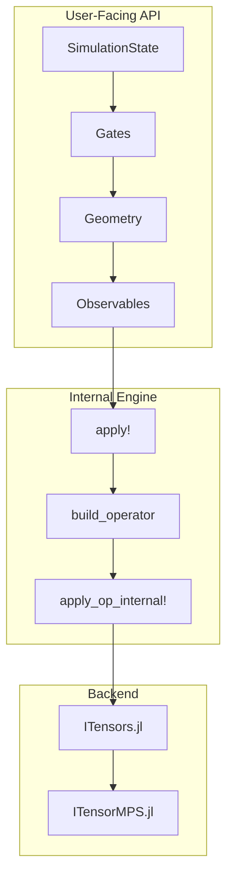

[](https://julialang.org/)
[](LICENSE)

# QuantumCircuitsMPS.jl

**MPS-based quantum circuit simulation for MIPT/CIPT research**

MIPT (Measurement-Induced Phase Transition) and CIPT (Control-Induced Phase Transition) are emergent phenomena in monitored quantum circuits where feedback, measurements, and unitary dynamics compete to create distinct entanglement phases.

---

## What is QuantumCircuitsMPS.jl?

**"PyTorch for Quantum Circuits"** — Physicists code as they speak, focusing on physics (Gates + Geometry) without touching MPS implementation details.

QuantumCircuitsMPS.jl is a pure Julia library for simulating quantum circuits using Matrix Product State (MPS) methods. It's purpose-built for researchers studying measurement-induced and control-induced phase transitions in monitored quantum systems.

> ⚠️ **Note**: This package is under active development. APIs may change and bugs may exist. Please report issues on [GitHub](https://github.com/hainingpan/QuantumCircuitsMPS.jl/issues).

**Why use this package?**

1. **Pure Julia MPS simulation**: No Python dependencies. Native Julia performance with ITensors.jl backend, scaling to 100+ qubits.

2. **Physics-first API**: Write circuits using intuitive abstractions (Gates + Geometry) without managing MPS bond dimensions, index orderings, or truncation schemes. The library handles tensor network details internally.

3. **Periodic boundary conditions**: Native PBC support via folded MPS indexing—standard MPS is naturally open boundary, but this package implements a novel folding trick (`ram_phy = [1, L, 2, L-1, ...]`) to support PBC efficiently without approximations or MPO tricks.

4. **Reproducible randomness**: Independent RNG streams for each source (`:ctrl`, `:haar`, `:born`, `:proj`, `:state_init`) enable reproducible trajectories. Useful in cross entropy benchmark and study quantum flucutuations.

**Philosophy**: Users write `apply!(state, HaarRandom(), Bricklayer(:odd))` and never see ITensor index objects, SVD calls, or orthogonalization centers. The package manages the gap between high-level physics intent and low-level tensor manipulations.

---

## Why QuantumCircuitsMPS.jl?

### Comparison with Existing Julia Quantum Libraries

| Feature | ITensors.jl | PastaQ.jl | Yao.jl | Qiskit.jl | **This Package** |
|---------|-------------|-----------|--------|-----------|------------------|
| **Primary Focus** | Tensor networks | Tomography & benchmarking | Variational algorithms | Circuit construction | **MIPT/CIPT dynamics** |
| **Backend** | MPS/MPO (via ITensorMPS) | MPS/MPO | State vector (+ YaoToEinsum) | No simulation* | **MPS (via ITensors)** |
| **MIPT/CIPT Support** | Build from scratch | Manual logic | State vector limited | N/A | **First-class** |
| **Scalability** | N=100+ | N=100+ | ~30 qubits | N/A | **N=100+** |
| **API Level** | Tensor-level | Circuit + Tomography | Block-level | Circuit construction | **Physics-level** |
| **Learning Curve** | Steep | Medium | Gentle | N/A | **Gentle** |

**\*Note:** Qiskit.jl is a circuit construction wrapper; MPS simulation requires Python Qiskit Aer.

### Package Strengths

**[ITensors.jl](https://github.com/ITensor/ITensors.jl)**: Excellent foundation for building custom tensor network algorithms. Provides full control over MPS details (bond dimensions, gauges, contraction orders), but requires users to manage these low-level concerns. Best choice when you need maximum flexibility for novel tensor network methods.

**[PastaQ.jl](https://github.com/GTorlai/PastaQ.jl)**: Designed for quantum tomography, process characterization, and benchmarking. Provides circuit simulation with MPS backend, but monitored circuits with feedback require manual composition of measurement logic. Ideal for tomography and noise studies.

**[Yao.jl](https://github.com/QuantumBFS/Yao.jl)**: Clean, composable API for variational quantum algorithms and quantum machine learning. Primary backend is state vector (limited to ~30 qubits), with tensor network support via YaoToEinsum. Excellent for gate-based algorithms on small-to-medium systems.

**[Qiskit.jl](https://github.com/Qiskit/Qiskit.jl)**: Julia wrapper for circuit construction, transpilation, and job submission to IBM Quantum. Does not include simulation capabilities—useful for interfacing with Qiskit's Python ecosystem.

**QuantumCircuitsMPS.jl**: Purpose-built for MIPT/CIPT research. Combines MPS scalability (N=100+) with a physics-first API that treats monitored circuits, feedback loops, and entanglement tracking as first-class features. Users define gates and geometries; the library handles all tensor network mechanics.

---

## Design Philosophy



### Layered Abstraction

**User-Facing API**: Physicists work with `SimulationState`, `Gates` (PauliX, HaarRandom, Projection), `Geometry` (Bricklayer, AllSites, StaircaseLeft), and `Observables` (EntanglementEntropy, DomainWall). No tensor network concepts exposed.

**Internal Engine**: The `apply!` function translates high-level physics operations into ITensor calls. It manages physical-to-RAM index mappings (`phy_ram`/`ram_phy`), operator construction, and MPS updates. Users never interact with this layer.

**Backend**: ITensors.jl and ITensorMPS.jl handle tensor contractions, SVD truncations, and gauge management. All low-level optimizations (bond dimensions, cutoffs, orthogonality centers) are managed automatically.

**Key Insight**: Users write physics in three lines of code. The package executes hundreds of tensor operations behind the scenes. This separation enables rapid prototyping without sacrificing performance or scalability.

---

## Installation

QuantumCircuitsMPS.jl is not yet registered in the Julia General registry. Install directly from GitHub:

```julia
using Pkg
Pkg.add(url="https://github.com/hainingpan/QuantumCircuitsMPS.jl")
```

### Dependencies

- **Required**: ITensors.jl, ITensorMPS.jl, JSON.jl
- **Optional**: Luxor.jl (for circuit visualization)

Julia 1.9 or higher is required.

---

## Quick Start

### MIPT Example: Measurement-Induced Phase Transition

```julia
using QuantumCircuitsMPS

# System parameters
L = 12                  # 12 qubits
p = 0.15               # Measurement probability (near critical point)
n_steps = 50           # Time evolution steps

# Build circuit: Haar random unitaries + stochastic measurements
circuit = Circuit(L=L, bc=:periodic, n_steps=1) do c
    # Even gates → measure → odd gates → measure per timestep
    apply!(c, HaarRandom(), Bricklayer(:even))
    apply_with_prob!(c; rng=:ctrl, outcomes=[
        (probability=p, gate=Measurement(:Z), geometry=AllSites())
    ])
    apply!(c, HaarRandom(), Bricklayer(:odd))
    apply_with_prob!(c; rng=:ctrl, outcomes=[
        (probability=p, gate=Measurement(:Z), geometry=AllSites())
    ])
end

# Initialize state and track entanglement entropy
state = SimulationState(
    L=L, bc=:periodic, maxdim=64,
    rng=RNGRegistry(ctrl=42, born=1, haar=2, proj=3)
)
initialize!(state, ProductState(binary_int=0))
track!(state, :entropy => EntanglementEntropy(; cut=L÷2))

# Run simulation
simulate!(circuit, state; n_circuits=n_steps, record_when=:every_step)

# Extract entropy trajectory
entropies = state.observables[:entropy]
println("Final entropy: $(entropies[end])")

# See examples/mipt_example.jl for full version
```

**Physics**: The competition between entangling Haar gates and disentangling measurements creates a phase transition at critical measurement rate p_c ≈ 0.16. Below p_c, the system exhibits volume-law entanglement; above p_c, area-law entanglement emerges.

### CIPT Example: Control-Induced Phase Transition

```julia
using QuantumCircuitsMPS

function run_cipt(L::Int, p_ctrl::Float64)
    # Define moving geometries for control-induced feedback
    left = StaircaseLeft(1)
    right = StaircaseRight(1)
    
    # Circuit step: conditional branching based on control probability
    function circuit_step!(state, t)
        apply_with_prob!(state; rng=:ctrl, outcomes=[
            (probability=p_ctrl, gate=Reset(), geometry=left),
            (probability=1-p_ctrl, gate=HaarRandom(), geometry=right)
        ])
    end
    
    # Observable evaluation depends on staircase position
    get_i1(state, t) = (current_position(left) % L) + 1
    
    # Functional simulation API
    results = simulate(
        L=L, bc=:periodic,
        init=ProductState(binary_int=1),
        rng=RNGRegistry(Val(:ct_compat), circuit=42, measurement=123),
        steps=2*L^2,
        circuit!=circuit_step!,
        observables=[:DW1 => DomainWall(order=1)],
        i1_fn=get_i1
    )
    
    return results[:DW1]  # Domain wall trajectory
end

# See examples/cipt_example.jl for full version
```

**Physics**: Control-induced feedback creates spatial structure in the entanglement. The staircase geometry moves deterministically, creating domain wall defects that track the effective entanglement boundary.

**More Examples**: The `examples/` directory contains complete scripts with parameter sweeps, data export, and visualization. Additional tutorials coming soon.

---

## Core API

### Main Abstractions

| Concept | Description | Examples |
|---------|-------------|----------|
| **Gates** | Quantum operations applied to qubits | `HaarRandom()`, `PauliX()`, `Reset()`, `Measurement(:Z)`, `Projection(:up)` |
| **Geometry** | Which qubits to apply gates to | `Bricklayer(:odd)`, `Bricklayer(:even)`, `AllSites()`, `Site(3)`, `StaircaseLeft(1)` |
| **Observables** | Quantities to measure during simulation | `EntanglementEntropy(; cut=L÷2)`, `DomainWall(order=1)`, `BornProbability()` |
| **SimulationState** | The quantum state + tracking | Holds MPS, RNG streams, recorded observables |

### Key Functions

| Function | Purpose | Example |
|----------|---------|---------|
| `apply!(state, gate, geometry)` | Apply a gate to specified sites | `apply!(state, HaarRandom(), Bricklayer(:odd))` |
| `apply_with_prob!(state; rng, outcomes)` | Probabilistic gate application | `apply_with_prob!(state; rng=:ctrl, outcomes=[...])` |
| `simulate(; L, bc, init, ...)` | Functional simulation API | See CIPT example |
| `track!(state, obs)` | Register observable for recording | `track!(state, :S => EntanglementEntropy())` |
| `record!(state; kwargs...)` | Record current observable values | `record!(state; i1=5)` |

### Simulation Workflow

```julia
# 1. Define circuit (declarative)
circuit = Circuit(L=12, bc=:periodic, n_steps=1) do c
    apply!(c, HaarRandom(), Bricklayer(:even))
    apply!(c, HaarRandom(), Bricklayer(:odd))
end

# 2. Create and initialize state
state = SimulationState(L=12, bc=:periodic, maxdim=64, rng=RNGRegistry(ctrl=42))
initialize!(state, ProductState(binary_int=0))

# 3. Track observables
track!(state, :entropy => EntanglementEntropy(; cut=6))

# 4. Simulate (circuit + state)
simulate!(circuit, state; n_circuits=50, record_when=:every_step)

# 5. Access results
state.observables[:entropy]
```

The workflow separates circuit definition from execution.

For complete API documentation, see the source code docstrings.

---

## Benchmarks

Performance benchmarks are being developed. Check back soon for:
- Scaling with system size (N = 10, 50, 100, 200 qubits)
- Bond dimension growth over circuit depth
- Comparison with direct state vector simulation

---

## Citation

If you use QuantumCircuitsMPS.jl in your research, please cite:

```bibtex
@software{quantumcircuitsmps,
  author = {Pan, Haining},
  title = {QuantumCircuitsMPS.jl: MPS-based Quantum Circuit Simulation},
  url = {https://github.com/hainingpan/QuantumCircuitsMPS.jl},
  year = {2026}
}
```

---

## Related Projects

- **[ITensors.jl](https://github.com/ITensor/ITensors.jl)**: General tensor network library (our backend)
- **[ITensorMPS.jl](https://github.com/ITensor/ITensorMPS.jl)**: MPS/MPO algorithms and optimizations
- **[PastaQ.jl](https://github.com/GTorlai/PastaQ.jl)**: Quantum tomography and circuit simulation
- **[Yao.jl](https://github.com/QuantumBFS/Yao.jl)**: Quantum algorithm simulation and variational methods

---

## License and Contributing

QuantumCircuitsMPS.jl is licensed under the [BSD 3-Clause License](LICENSE).

**Bug Reports**: Please open an issue on [GitHub Issues](https://github.com/hainingpan/QuantumCircuitsMPS.jl/issues).

**Contributions**: Contributions are welcome! Fork the repository and submit a pull request. Please include tests for new features.

**Development Status**: This package is under active development. APIs may change before reaching version 1.0.
