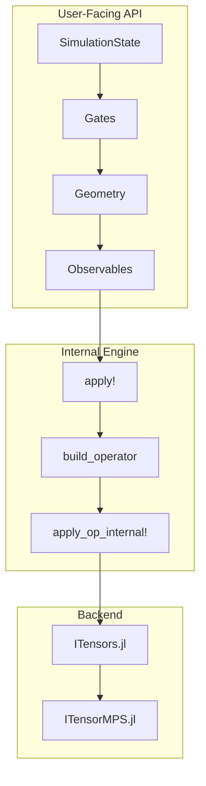

[](https://julialang.org/)
[](LICENSE)

# QuantumCircuitsMPS.jl

**MPS-based quantum circuit simulation for MIPT/CIPT research**

MIPT (Measurement-Induced Phase Transition) and CIPT (Control-Induced Phase Transition) are emergent phenomena in monitored quantum circuits where feedback, measurements, and unitary dynamics compete to create distinct entanglement phases.

---
## What is QuantumCircuitsMPS.jl?

- **"PyTorch for Quantum Circuits"** — Physicists code as they speak: focusing on physics without touching implementation details.
- A pure Julia library for simulating quantum circuits using Matrix Product State (MPS) methods. It's purpose-built for researchers studying measurement-induced and control-induced phase transitions in monitored quantum systems.

> ⚠️ **Note**: This package is under active development. APIs may change and bugs may exist. Please report issues on [GitHub](https://github.com/hainingpan/QuantumCircuitsMPS.jl/issues).

**Why use this package?**

1. **Pure Julia MPS simulation**: Native Julia performance with ITensors.jl backend, scaling to 100+ qubits.
2. **Physics-first API**: Write circuits using intuitive abstractions (Gates + Geometry) without managing MPS bond dimensions, index orderings, or truncation schemes. The library handles tensor network details internally.
3. **Reproducible randomness**: Independent RNG streams for each source (`:gates_spacetime`, `:gates_realization`, `:born_measurement`, `:state_init`) enable reproducible trajectories. Useful in cross entropy benchmark and study quantum flucutuations.

**Philosophy**: Users write `apply!(state, HaarRandom(), Bricklayer(:odd))` and never see ITensor index objects, SVD calls, or orthogonalization centers. The package manages the gap between high-level physics intent and low-level tensor manipulations.

---
## Why QuantumCircuitsMPS.jl?

### Comparison with Existing Julia Quantum Libraries

| Feature | ITensors.jl | PastaQ.jl | Yao.jl | Qiskit.jl | **This Package** |
|---------|-------------|-----------|--------|-----------|------------------|
| **Primary Focus** | Tensor networks | Tomography & benchmarking | Variational algorithms | Circuit construction | **MIPT/CIPT dynamics** |
| **Backend** | MPS/MPO (via ITensorMPS) | MPS/MPO | State vector (+ YaoToEinsum) | No simulation* | **MPS (via ITensors)** |
| **MIPT/CIPT Support** | Build from scratch | Manual logic | State vector limited | N/A | **First-class** |
| **Scalability** | N=100+ | N=100+ | ~30 qubits | N/A | **N=100+** |
| **API Level** | Tensor-level | Circuit + Tomography | Block-level | Circuit construction | **Physics-level** |
| **Learning Curve** | Steep | Medium | Gentle | N/A | **Gentle** |

**\*Note:** Qiskit.jl is a circuit construction wrapper; MPS simulation requires Python Qiskit Aer.

---
## Design Philosophy


```mermaid
flowchart TB
    subgraph "User-Facing API"
        A[SimulationState] --> B[Gates]
        B --> C[Geometry]
        C --> D[Observables]
    end
    subgraph "Internal Engine"
        E[apply!] --> F[build_operator]
        F --> G[apply_op_internal!]
    end
    subgraph "Backend"
        H[ITensors.jl] --> I[ITensorMPS.jl]
    end
    D --> E
    G --> H
```

### Layered Abstraction

- **User-Facing API**: Physicists work with `SimulationState`, `Gates` (PauliX, HaarRandom, Projection), `Geometry` (Bricklayer, AllSites, StaircaseLeft), and `Observables` (EntanglementEntropy, Magnetization). No tensor network concepts exposed.
- **Internal Engine**: The `apply!` function translates high-level physics operations into ITensor calls. It manages physical-to-RAM index mappings (`phy_ram`/`ram_phy`), operator construction, and MPS updates. Users never interact with this layer.
- **Backend**: ITensors.jl and ITensorMPS.jl handle tensor contractions, SVD truncations, and gauge management. All low-level optimizations (bond dimensions, cutoffs, orthogonality centers) are managed automatically.
- **Key Insight**: Users write physics in three lines of code; the package executes hundreds of tensor operations behind the scenes, enabling rapid prototyping without sacrificing performance or scalability.

### The Unified Stochastic Rule

Every probabilistic operation in the package, from a single measurement to a multi-outcome control protocol, follows ONE rule: `apply_with_prob!(c; outcomes=[(probability=p, gate=g, geometry=geo), ...])` expands each outcome's `geometry` into a list of elements (site groups), and every outcome must expand to the SAME element count `K`. For each element `k = 1..K`, the engine draws exactly one coin from the `:gates_spacetime` stream and makes a categorical selection among the outcomes at that element; the remainder `1 - Σp` selects identity (nothing applied). There is no separate "independent Bernoulli per outcome" code path and no second RNG scheme hiding in a compound geometry — one rule, one selection function, everywhere.
This single rule is what makes exclusive per-bond gate choices natural: `outcomes=[(probability=0.5, gate=HaarRandom(), geometry=Bricklayer(:even)), (probability=0.5, gate=CZ(), geometry=Bricklayer(:even))]` guarantees every even bond gets EXACTLY one of `HaarRandom()` or `CZ()`, never both and never neither (when `Σp = 1`). Correlated layers (the SAME coin choosing an entire layer, not per-bond) are expressed with `ProductGate`, not with a second probabilistic construct.

### Broadcast vs. Set Geometry

Geometries fall into two families, and knowing which one you're holding tells you exactly how it behaves inside `apply_with_prob!` and `apply!`:

- **Broadcast** ("distribution") geometries expand to `K ≥ 1` independent elements, each getting its own gate application (and, inside a stochastic op, its own coin): `AllSites()`, `Bricklayer(parity)`, `EachSite(collection)`.
- **Set** ("region") geometries denote ONE region of sites, a single element: `SingleSite(i)`, `AdjacentPair(i)`, `Sites(collection)`, `StaircaseLeft`/`StaircaseRight`, `Pointer`.
`is_broadcast(geo)` reports the trait, and `elements(geo, L, bc)` returns the canonical enumeration either way, always `Vector{Vector{Int}}`. This vocabulary is also why `EachSite(2:L-1)` and `Sites(2:L-1)` look similar but mean opposite things: `EachSite` applies a single-site gate independently at each of sites 2 through L-1 (K = L-2 coins, K = L-2 possible applications), while `Sites(2:L-1)` is ONE region spanning sites 2 through L-1 for a single gate whose support equals `L-2`.

---
## Installation

`QuantumCircuitsMPS.jl` is not yet registered in the Julia General registry.

```julia
using Pkg
Pkg.add(url="https://github.com/hainingpan/QuantumCircuitsMPS.jl")
```
**Local development**: `cd /path/to/QuantumCircuitsMPS.jl && julia --project=.`, then:
```julia
using Pkg
Pkg.instantiate()
using QuantumCircuitsMPS, Revise
```
**Dependencies**: ITensors.jl, ITensorMPS.jl, JSON.jl (required); Luxor.jl (optional, for circuit visualization). Julia 1.11+ required.

---
## Quick Start

### MIPT Example: Measurement-Induced Phase Transition

```julia
using QuantumCircuitsMPS

# System parameters
L = 12                  # 12 qubits
p = 0.15               # Measurement probability (near critical point)
n_steps = 50           # Time evolution steps

# Haar random unitaries + stochastic measurements; record! marks snapshot points
circuit = Circuit(L=L, bc=:periodic) do c
    # Even gates → measure → odd gates → measure per timestep
    apply!(c, HaarRandom(), Bricklayer(:even))
    apply_with_prob!(c; outcomes=[
        (probability=p, gate=Measure(:Z), geometry=AllSites())
    ])
    record!(c, :entropy)
    apply!(c, HaarRandom(), Bricklayer(:odd))
    apply_with_prob!(c; outcomes=[
        (probability=p, gate=Measure(:Z), geometry=AllSites())
    ])
    record!(c, :entropy)
end

# Initialize state and track entanglement entropy
state = SimulationState(
    L=L, bc=:periodic, maxdim=64,
    rng=RNGRegistry(gates_spacetime=42, born_measurement=1, gates_realization=2)
)
initialize!(state, ProductState(binary_int=0))
track!(state, :entropy => EntanglementEntropy(; cut=L÷2))

# record_when=:marks fires at each record!(c, ...) marker, twice per step
simulate!(circuit, state; n_steps=n_steps, record_when=:marks)

# Extract entropy trajectory
entropies = state.observables[:entropy]
println("Final entropy: $(entropies[end])")

# See examples/mipt_example.ipynb for the full tutorial
```

**Physics**: The competition between entangling Haar gates and disentangling measurements creates a phase transition at critical measurement rate p_c ≈ 0.16. Below p_c, the system exhibits volume-law entanglement; above p_c, area-law entanglement emerges.

### CIPT Example: Control-Induced Phase Transition

```julia
using QuantumCircuitsMPS

# System parameters
L = 8                   # Number of qubits
p_ctrl = 0.5            # Control probability (critical point p_c ≈ 0.5)
n_steps = 2 * L^2       # Timesteps (staircase sweeps)

# Build circuit: each step, a coin flip applies Reset (moving left) or Haar (moving right)
left = StaircaseLeft(1)
right = StaircaseRight(1)

circuit = Circuit(L=L, bc=:periodic, p_ctrl=p_ctrl) do c
    apply_with_prob!(c; outcomes=[
        (probability=c.params[:p_ctrl], gate=Reset(), geometry=left),
        (probability=1-c.params[:p_ctrl], gate=HaarRandom(), geometry=right)
    ])
end

# Initialize state and track magnetization Mz = (1/L) Σᵢ ⟨Zᵢ⟩
state = SimulationState(L=L, bc=:periodic, maxdim=64,
    rng=RNGRegistry(gates_spacetime=42, born_measurement=1, gates_realization=2))
initialize!(state, ProductState(binary_int=0))
track!(state, :Mz => Magnetization(:Z))

# Run simulation
simulate!(circuit, state; n_steps=n_steps, record_when=:every_gate)

mz_vals = state.observables[:Mz]
println("Final Mz: $(mz_vals[end])")

# See examples/cipt_example.ipynb for the full tutorial
```

**Physics**: The competition between Reset gates (which project qubits to |0⟩) and Haar random unitaries (which entangle qubits) drives a phase transition at p_c ≈ 0.5. In the reset-dominated phase (p_ctrl > 0.5), the magnetization Mz → +1 as qubits are repeatedly reset to |0⟩. In the unitary-dominated phase (p_ctrl < 0.5), Mz → 0 as random unitaries scramble the state. The staircase geometries sweep in opposite directions, creating the spatial competition that drives the transition.

`Reset()` above is sugar: it's exactly `Measure(:Z; feedback=OnOutcome(1 => PauliX()))` (measure, then flip back to |0⟩ if the outcome was 1) — see the "Feedback & Custom Gates" section below for the general form, which lets you swap the flip for any gate, or for an arbitrary closure.

### AKLT Example: Forced Measurement Protocol

```julia
using QuantumCircuitsMPS

# System parameters
L = 12                    # Chain length
bc = :periodic            # Boundary conditions
p_nn = 1.0               # Pure NN projections (set to 0.0 for NNN)

# Create spin projection gate (projects out S=2 quintet sector)
P0, P1 = total_spin_projector(0), total_spin_projector(1)
proj_gate = SpinSectorProjection(P0 + P1)

# Build circuit: apply projections to all NN pairs
circuit = Circuit(L=L, bc=bc) do c
    apply_with_prob!(c; outcomes=[
        (probability=p_nn, gate=proj_gate, geometry=Bricklayer(:nn)),
        (probability=1-p_nn, gate=proj_gate, geometry=Bricklayer(:nnn))
    ])
end

# Initialize state and track observables
state = SimulationState(L=L, bc=bc, site_type="S=1", maxdim=128,
    rng=RNGRegistry(gates_spacetime=42, gates_realization=2, born_measurement=3))
initialize!(state, ProductState(spin_state="Z0"))

track!(state, :entropy => EntanglementEntropy(cut=L÷2, renyi_index=1, base=2))
track!(state, :string_order => StringOrder(1, L÷2+1, order=1))

# Run L layers of projections
simulate!(circuit, state; n_steps=L, record_when=:every_step)

# Results: NN AKLT converges to S ≈ 2.0, |SO| ≈ 0.444
println("Entropy: $(state.observables[:entropy][end])")
println("|String Order|: $(abs(state.observables[:string_order][end]))")

# See examples/AKLT_forcedmeas.ipynb for the full tutorial with NNN support
```

**Physics**: The AKLT (Affleck-Kennedy-Lieb-Tasaki) state is a paradigmatic example of symmetry-protected topological order. By projecting out the S=2 quintet sector from adjacent spin-1 pairs, the protocol converges to the AKLT ground state characterized by string order parameter |O| ≈ 4/9.

### Feedback & Custom Gates

Measurement feedback, arbitrary unitaries, and correlated layers are all first-class:

```julia
using QuantumCircuitsMPS

# --- 1. Closure feedback: adaptive random-unitary response ---
L = 6
circuit = Circuit(L=L, bc=:open) do c
    apply!(c, HaarRandom(), Bricklayer(:odd))
    apply_with_prob!(c; outcomes=[
        (probability=1.0,
         gate=Measure(:Z; feedback=(state, sites, outcome) ->
             outcome == 1 && apply!(state, HaarRandom(1), SingleSite(sites[1]))),
         geometry=EachSite(2:L-1))
    ])
end

state = SimulationState(L=L, bc=:open, maxdim=32,
    rng=RNGRegistry(gates_spacetime=7, gates_realization=8, born_measurement=9, state_init=1),
    log_events=true)
initialize!(state, ProductState(binary_int=0))
simulate!(circuit, state; n_steps=3)
n_outcomes = length(QuantumCircuitsMPS.measurements(state))
println("Feedback circuit ran 3 steps, $(n_outcomes) measurement outcomes logged")

# --- 2. MatrixGate: any hand-supplied unitary as a gate ---
state2 = SimulationState(L=2, bc=:open, maxdim=16,
    rng=RNGRegistry(gates_spacetime=1, gates_realization=2, born_measurement=3))
initialize!(state2, ProductState(binary_int=0))
apply!(state2, MatrixGate([0.0 1.0; 1.0 0.0]), SingleSite(1))
println("MatrixGate(X) flipped site 1: P(site1=1) = $(born_probability(state2, 1, 1))")

# --- 3. ProductGate: ONE coin governs an entire correlated layer ---
pg_haar = ProductGate(HaarRandom(), Bricklayer(:even))
state3 = SimulationState(L=4, bc=:open, maxdim=16,
    rng=RNGRegistry(gates_spacetime=1, gates_realization=2, born_measurement=3))
initialize!(state3, ProductState(binary_int=0))
track!(state3, :entropy => EntanglementEntropy(; cut=2))
apply!(state3, pg_haar)  # geometry omitted — fills in Sites(union) automatically
record!(state3)
println("ProductGate layer applied: entropy = $(state3.observables[:entropy][end])")
```

---
## Core API

### Main Abstractions

| Concept | Description | Examples |
|---------|-------------|----------|
| **Gates** | Quantum operations applied to qubits | `HaarRandom()`, `HaarRandom(n)`, `PauliX()`, `Reset()`, `Measure(:Z; feedback=...)`, `MatrixGate(U)`, `Rx(θ)`/`Ry(θ)`/`Rz(θ)`, `Hadamard()`, `ProductGate(gate, geometry)`, `Projection(0)`, `SpinSectorProjection()` |
| **Feedback** | Classical response to a `Measure` outcome | `OnOutcome(1 => PauliX())` (declarative), `(state, sites, outcome) -> ...` (closure escape hatch) |
| **Geometry** | Which qubits to apply gates to (broadcast vs. set — see Design Philosophy) | `Bricklayer(:odd)`, `Bricklayer(:even)`, `Bricklayer(:nn)`, `Bricklayer(:nnn)`, `AllSites()`, `EachSite(2:L-1)`, `SingleSite(3)`, `Sites(1:4)`, `StaircaseLeft(1)` |
| **Recording markers** | Explicit `record!(c[, names...])` positions inside a `Circuit` do-block | `record!(c)` (all tracked observables), `record!(c, :entropy)` (selective) |
| **Observables** | Quantities to measure during simulation | `EntanglementEntropy(; cut=L÷2)`, `DomainWall(order=1)`, `BornProbability(1, 0)`, `Magnetization(:Z)`, `StringOrder(i, j; order=1)` |
| **SimulationState** | The quantum state + tracking | Holds MPS, RNG streams, recorded observables, opt-in event log (`log_events=true`) |

### Bricklayer Geometry Parities

The `Bricklayer` geometry supports multiple parities for different gate application patterns:

| Parity | Description | Pairs (L=12 periodic) |
|--------|-------------|----------------------|
| `:odd` | NN sublayer 1 | (1,2), (3,4), (5,6), (7,8), (9,10), (11,12) |
| `:even` | NN sublayer 2 | (2,3), (4,5), (6,7), (8,9), (10,11), (12,1) |
| **`:nn`** | All NN pairs (combines :odd + :even) | All 12 NN bonds |
| `:nnn_odd_1` | NNN sublayer 1 | (1,3), (5,7), (9,11) |
| `:nnn_odd_2` | NNN sublayer 2 | (3,5), (7,9), (11,1) |
| `:nnn_even_1` | NNN sublayer 3 | (2,4), (6,8), (10,12) |
| `:nnn_even_2` | NNN sublayer 4 | (4,6), (8,10), (12,2) |
| **`:nnn`** | All NNN pairs (combines all 4 sublayers) | All 12 NNN bonds |

### String Order Observable

The `StringOrder` observable measures the non-local string order parameter for spin-1 chains:

```julia
using QuantumCircuitsMPS
StringOrder(1, 7; order=1)  # order=1 (default) for NN AKLT, order=2 for NNN AKLT
```

| Parameter | Formula | Expected Value |
|-----------|---------|----------------|
| `order=1` | ⟨Sz[i] · exp(iπΣ) · Sz[j]⟩ | \|O¹\| ≈ 4/9 ≈ 0.444 |
| `order=2` | ⟨Sz[n]·Sz[n+1] · exp(iπΣ) · Sz[m-1]·Sz[m]⟩ | \|O²\| ≈ (4/9)² ≈ 0.198 |

Note: `order=2` requires `j >= i+4` for non-overlapping endpoint pairs.

### Key Functions

| Function | Purpose | Example |
|----------|---------|---------|
| `apply!(state, gate, geometry)` | Apply a gate to specified sites | `apply!(state, HaarRandom(), Bricklayer(:odd))` |
| `apply_with_prob!(c_or_state; outcomes)` | Unified per-element categorical gate application (builder or eager form; all coins from `:gates_spacetime`) | `apply_with_prob!(c; outcomes=[(probability=p, gate=Measure(:Z), geometry=AllSites())])` |
| `record!(c::CircuitBuilder[, names...])` | Insert a recording marker inside a `Circuit` do-block | `record!(c)`, `record!(c, :entropy)` |
| `simulate!(circuit, state; n_steps=50, record_when=:every_step)` | Run circuit n_steps times; `record_when ∈ {:every_step, :every_gate, :final_only, :marks, predicate}` | See Quick Start |
| `track!(state, obs)` | Register observable for recording | `track!(state, :S => EntanglementEntropy(; cut=6))` |
| `record!(state; i1=nothing)` | Record current observable values (eager form) | `record!(state)` |
| `events(state)` / `measurements(state)` | Typed event-log accessors (requires `log_events=true`) | Post-selection: `all(m -> m.outcome == 0, measurements(state))` |
| `expected_draws(circuit, n_steps)` | Fixed `:gates_spacetime` coin consumption for a circuit run | Draw-count invariant checks |
| `plot_circuit(circuit; filename)` | Export circuit diagram to SVG | Requires `using Luxor` |
| `print_circuit(circuit)` | ASCII circuit visualization | Prints to console |

### Simulation Workflow

```julia
using QuantumCircuitsMPS
circuit = Circuit(L=12, bc=:periodic) do c
    apply!(c, HaarRandom(), Bricklayer(:even))
    apply!(c, HaarRandom(), Bricklayer(:odd))
end
state = SimulationState(L=12, bc=:periodic, maxdim=64, rng=RNGRegistry(gates_spacetime=42, gates_realization=1, born_measurement=2))
initialize!(state, ProductState(binary_int=0))
track!(state, :entropy => EntanglementEntropy(; cut=6))
simulate!(circuit, state; n_steps=50, record_when=:every_step)
state.observables[:entropy]
```

Circuit definition (declarative) is kept separate from execution. For complete API documentation, see the source code docstrings.
---
## Citation

If you use QuantumCircuitsMPS.jl in your research, please cite:

```bibtex
@software{quantumcircuitsmps,
  author = {Pan, Haining and Pixley, Jedediah H},
  title = {QuantumCircuitsMPS.jl: MPS-based Quantum Circuit Simulation},
  url = {https://github.com/hainingpan/QuantumCircuitsMPS.jl},
  year = {2026}
}
```

---
## Related Projects

- **[ITensors.jl](https://github.com/ITensor/ITensors.jl)**: General tensor network library (our backend)
- **[ITensorMPS.jl](https://github.com/ITensor/ITensorMPS.jl)**: MPS/MPO algorithms and optimizations
- **[PastaQ.jl](https://github.com/GTorlai/PastaQ.jl)**: Quantum tomography and circuit simulation
- **[Yao.jl](https://github.com/QuantumBFS/Yao.jl)**: Quantum algorithm simulation and variational methods

---

## Known Limitations / Future Work

- **RNG stream name hardcoded**: The stochastic engine always draws from `:gates_spacetime`. In principle, different probabilistic operations could use independently named streams — this is deferred until a concrete research use case requires it.

---
## License and Contributing

QuantumCircuitsMPS.jl is licensed under the [BSD 3-Clause License](LICENSE).

- **Bug Reports**: [GitHub Issues](https://github.com/hainingpan/QuantumCircuitsMPS.jl/issues)
- **Contributions**: Welcome — fork the repository and submit a pull request with tests for new features.
- **Development Status**: Active development; APIs may change before reaching version 1.0.
